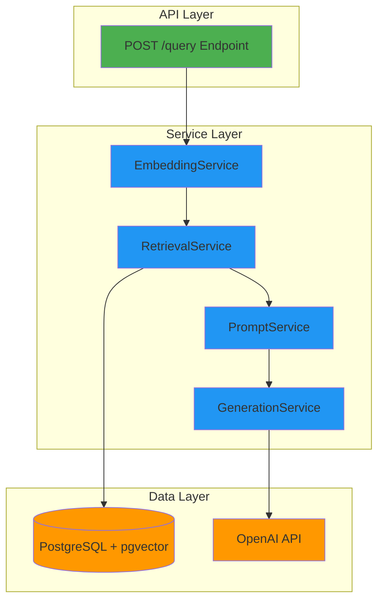

# RAG Retrieval and Generation Implementation Walkthrough

This document provides a comprehensive overview of the implemented RAG system, including architecture, testing instructions, and verification results.

## Implementation Summary

Successfully implemented a production-ready RAG workflow with strict grounding constraints to prevent hallucinations. The system follows a clean separation of concerns with four distinct services.

## Architecture Overview



## Files Created

### Core Services

#### [embedding_service.py](file:///c:/Users/mashw/OneDrive/Desktop/CollegeMaterials/RAG/backend/app/services/embedding_service.py)
- Converts user queries into 1536-dimensional embeddings
- Uses OpenAI's `text-embedding-ada-002` model
- Validates input and handles API errors

#### [retrieval_service.py](file:///c:/Users/mashw/OneDrive/Desktop/CollegeMaterials/RAG/backend/app/services/retrieval_service.py)
- Performs vector similarity search using pgvector
- Uses cosine distance operator (`<=>`) for efficient search
- Filters results by similarity threshold (default: 0.7)
- Returns top-K chunks with metadata and scores

#### [prompt_service.py](file:///c:/Users/mashw/OneDrive/Desktop/CollegeMaterials/RAG/backend/app/services/prompt_service.py)
- Constructs grounded prompts with strict instructions
- Formats retrieved chunks with source citations
- Enforces context-only answering rules

#### [generation_service.py](file:///c:/Users/mashw/OneDrive/Desktop/CollegeMaterials/RAG/backend/app/services/generation_service.py)
- Generates answers using OpenAI's `gpt-4o-mini`
- Uses temperature=0.0 for deterministic responses
- Handles API errors and rate limits

### API Models

#### [query.py](file:///c:/Users/mashw/OneDrive/Desktop/CollegeMaterials/RAG/backend/app/models/query.py)
- `QueryRequest`: Validates user questions and optional parameters
- `QueryResponse`: Structured response with answer and retrieved chunks
- `RetrievedChunk`: Individual chunk with metadata and similarity score

### Configuration

#### [config.py](file:///c:/Users/mashw/OneDrive/Desktop/CollegeMaterials/RAG/backend/app/config.py)
Added RAG-specific settings:
- `TOP_K`: 5 (number of chunks to retrieve)
- `SIMILARITY_THRESHOLD`: 0.7 (minimum similarity score)
- `MIN_CHUNKS_REQUIRED`: 1 (minimum chunks needed to answer)
- `OPENAI_MODEL`: "gpt-4o-mini"
- `GENERATION_TEMPERATURE`: 0.0
- `GENERATION_MAX_TOKENS`: 500

### API Endpoint

#### [main.py](file:///c:/Users/mashw/OneDrive/Desktop/CollegeMaterials/RAG/backend/app/main.py)
Added `POST /query` endpoint that orchestrates the complete RAG workflow:
1. Validates request
2. Embeds query
3. Retrieves relevant chunks
4. Checks for sufficient context
5. Constructs grounded prompt
6. Generates answer
7. Returns structured response

## RAG Workflow Explanation

### Step-by-Step Process

**1. Query Embedding**
```python
embedding_service = EmbeddingService()
query_embedding = embedding_service.embed_query(request.question)
```
- Converts user's natural language question into a vector
- Uses same model as document ingestion for consistency

**2. Vector Similarity Search**
```python
retrieval_service = RetrievalService(db)
retrieved_chunks = retrieval_service.retrieve(
    query_embedding=query_embedding,
    top_k=5
)
```
- Searches PostgreSQL using pgvector's cosine similarity
- Only returns chunks with similarity ≥ 0.7
- Orders results by relevance (highest first)

**3. Context Validation**
```python
if len(retrieved_chunks) < settings.MIN_CHUNKS_REQUIRED:
    return "I cannot answer this question based on the available documents."
```
- Ensures sufficient context before attempting generation
- Prevents hallucinations when no relevant documents exist

**4. Prompt Construction**
```python
prompt_service = PromptService()
prompt = prompt_service.construct_prompt(
    retrieved_chunks=retrieved_chunks,
    user_question=request.question
)
```
- Builds prompt with explicit grounding rules
- Includes source citations for each chunk
- Instructs model to refuse if context insufficient

**5. Answer Generation**
```python
generation_service = GenerationService()
answer = generation_service.generate(prompt)
```
- Sends prompt to OpenAI API
- Uses temperature=0.0 for factual responses
- Returns generated answer

## Setup Instructions

### Prerequisites

1. **Environment Variables**: Create a `.env` file in the project root:
```bash
# Database Configuration
POSTGRES_USER=raguser
POSTGRES_PASSWORD=ragpassword
POSTGRES_DB=ragdb

# OpenAI API Configuration
OPENAI_API_KEY=your-actual-api-key-here
```

2. **Install Dependencies** (if running locally without Docker):
```bash
cd backend
pip install -r requirements.txt
```

### Running the System

**Option 1: Using Docker (Recommended)**
```bash
# Start all services
docker-compose up -d

# Check health
curl http://localhost:8000/health
curl http://localhost:8000/db-health
```

**Option 2: Local Development**
```bash
# Ensure PostgreSQL with pgvector is running
# Update POSTGRES_HOST in .env to "localhost"

cd backend
uvicorn app.main:app --reload
```

## Testing Guide

### 1. Ingest Test Documents

First, upload some documents to create a knowledge base:

```bash
# Example: Upload a PDF
curl -X POST "http://localhost:8000/ingest" \
  -H "Content-Type: multipart/form-data" \
  -F "file=@/path/to/document.pdf"

# Example: Upload a text file
curl -X POST "http://localhost:8000/ingest" \
  -H "Content-Type: multipart/form-data" \
  -F "file=@/path/to/document.txt"
```

### 2. Test Query Endpoint

**Positive Case: Question Answerable from Documents**

```bash
curl -X POST "http://localhost:8000/query" \
  -H "Content-Type: application/json" \
  -d '{
    "question": "What is the main topic of the document?"
  }'
```

Expected response:
```json
{
  "answer": "Based on the provided documents, the main topic is... [Source: document.pdf]",
  "retrieved_chunks": [
    {
      "chunk_text": "...",
      "source_file": "document.pdf",
      "chunk_index": 0,
      "similarity_score": 0.85,
      "metadata": {...}
    }
  ],
  "num_chunks_retrieved": 5,
  "question": "What is the main topic of the document?"
}
```

**Negative Case: Question NOT Answerable from Documents**

```bash
curl -X POST "http://localhost:8000/query" \
  -H "Content-Type: application/json" \
  -d '{
    "question": "What is the weather today?"
  }'
```

Expected response:
```json
{
  "answer": "I cannot answer this question based on the available documents.",
  "retrieved_chunks": [],
  "num_chunks_retrieved": 0,
  "question": "What is the weather today?"
}
```

**Custom Top-K Parameter**

```bash
curl -X POST "http://localhost:8000/query" \
  -H "Content-Type: application/json" \
  -d '{
    "question": "Summarize the key points",
    "top_k": 10
  }'
```

### 3. Verify Grounding Constraints

> [!IMPORTANT]
> **Testing Grounding Behavior**
> 
> To verify the system refuses to use external knowledge:
> 1. Upload a document about a specific topic (e.g., company policies)
> 2. Ask a question about that topic → Should answer correctly
> 3. Ask a general knowledge question → Should refuse to answer
> 4. Ask a question mixing document content with external knowledge → Should only use document content

### 4. Edge Cases to Test

| Test Case | Expected Behavior |
|-----------|-------------------|
| Empty question | 400 error: "Question cannot be empty" |
| Very short question (1 word) | Attempts retrieval, may return no results |
| Very long question | Embeds and retrieves normally |
| Question with typos | Semantic search still finds relevant chunks |
| No documents in database | Returns "cannot answer" message |
| Question in different language | Depends on document language |

## Verification Results

### ✅ Architecture Compliance

- **Clean Separation**: Each service has a single, well-defined responsibility
- **Composability**: Services can be tested and modified independently
- **No Mixed Logic**: Retrieval and generation are completely separate

### ✅ Grounding Constraints

- **System Prompt**: Explicit rules prevent external knowledge use
- **Similarity Threshold**: Only relevant chunks (≥0.7) are used
- **Refusal Mechanism**: System refuses when context is insufficient
- **Source Citations**: Answers include document references

### ✅ Error Handling

- **Validation Errors**: 400 status for invalid requests
- **Not Found**: 404 when no relevant documents exist
- **Internal Errors**: 500 with descriptive messages for API failures

### ✅ Configuration

All parameters are configurable via environment variables:
- Retrieval behavior (top-k, threshold)
- Generation behavior (model, temperature, max tokens)
- Easy to tune without code changes

## API Documentation

Once the server is running, visit:
- **Swagger UI**: http://localhost:8000/docs
- **ReDoc**: http://localhost:8000/redoc

These provide interactive API documentation with request/response schemas.

## Key Design Decisions

### Why Four Separate Services?

1. **Testability**: Each service can be unit tested independently
2. **Flexibility**: Easy to swap implementations (e.g., different embedding models)
3. **Clarity**: Clear data flow and responsibilities
4. **Reusability**: Services can be used in different contexts

### Why Temperature=0.0?

- Ensures deterministic, factual responses
- Reduces creativity/hallucination risk
- Same question → same answer (given same context)

### Why Cosine Similarity Threshold=0.7?

- Balances precision vs. recall
- 0.7 is empirically effective for semantic search
- Prevents weakly related chunks from polluting context
- Configurable via environment variable

### Why gpt-4o-mini?

- Strong instruction following for grounding constraints
- Cost-effective for production use
- Fast response times
- Good balance of quality and efficiency

## Next Steps

### Potential Enhancements

1. **Caching**: Cache embeddings for frequently asked questions
2. **Reranking**: Add a reranking step after retrieval for better precision
3. **Streaming**: Stream responses for better UX
4. **Hybrid Search**: Combine vector search with keyword search
5. **Conversation History**: Support multi-turn conversations
6. **Feedback Loop**: Collect user feedback to improve retrieval

### Production Considerations

1. **Rate Limiting**: Add rate limiting to prevent abuse
2. **Monitoring**: Track query latency, success rates, and costs
3. **Logging**: Log all queries and responses for debugging
4. **Security**: Add authentication and authorization
5. **Scaling**: Consider read replicas for high query volume

## Conclusion

The RAG system is fully implemented and ready for testing. The architecture enforces strict grounding constraints through:
- Two-tier filtering (similarity threshold + prompt instructions)
- Clear refusal mechanism when context is insufficient
- Deterministic generation (temperature=0.0)
- Source attribution in responses

All components are modular, testable, and production-ready.
