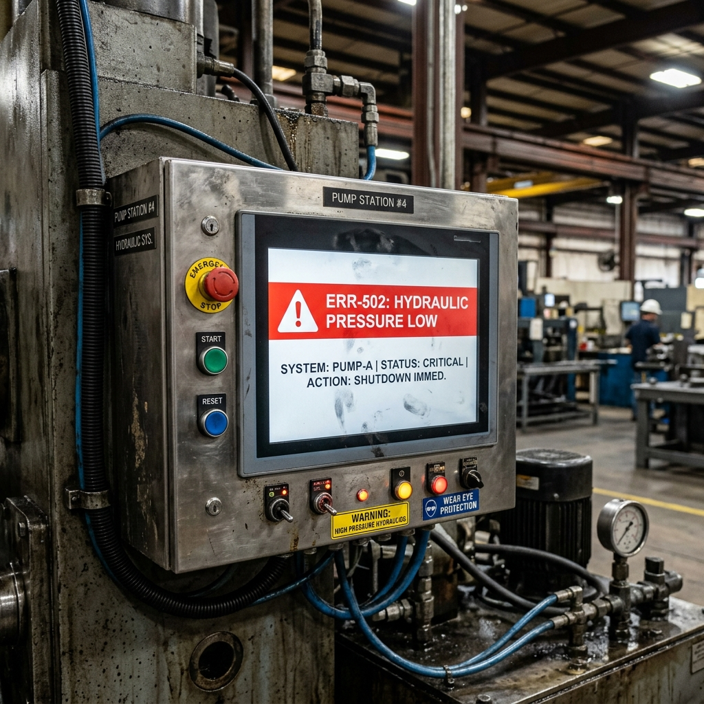
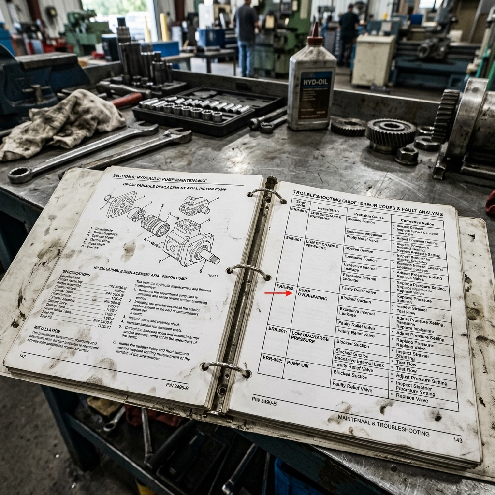
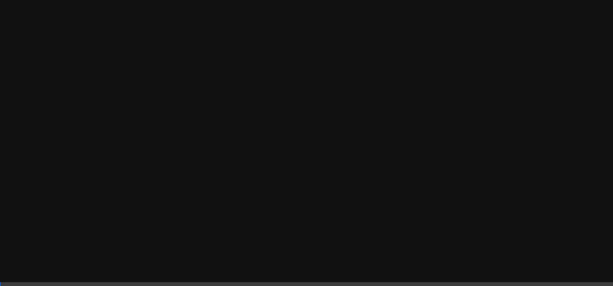

# Vision RAG System Demonstration

The system has been fully started (both backend and frontend) and tested! Below are the generated test images and a screen recording of the automated interaction with the frontend.

## 1. Generated Testing Materials

These images were generated to test the Vision-RAG's ability to detect industrial anomalies and cross-reference them with manuals.

**Machine HMI Error Image**

**Machine Manual Image**

## 2. Frontend Testing Recording

The AI agent navigated to the Avengers-themed frontend, explored the **Vision-RAG** upload interface, and queried the **RAG Terminal** for the `ERR-502` code.

> [!TIP]
> **Try it yourself!** If the system is currently running on your machine, you can open your browser and navigate to `http://localhost:5173` to interact with the interface directly. You can use the generated images above to test the Vision-RAG upload functionality.
