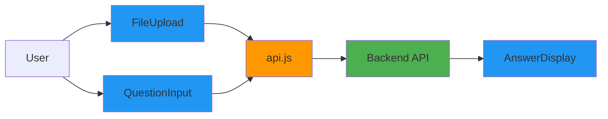

# React Frontend Implementation Walkthrough

Complete documentation of the minimal React frontend for the RAG backend.

## Implementation Summary

Successfully created a clean, minimal React frontend with three focused components, honest state communication, and subtle UX animations. The frontend strictly adheres to the principle of being a thin client—no RAG logic, no AI behavior, only clear presentation of backend results.

## Architecture



## Files Created

### Core Components

#### [FileUpload.jsx](file:///c:/Users/mashw/OneDrive/Desktop/CollegeMaterials/RAG/frontend/src/components/FileUpload.jsx)
**Responsibilities:**
- File input (PDF, TXT only)
- Client-side file type validation
- Upload to `/ingest` endpoint
- Display upload status

**State Management:**
- `isUploading`: Boolean for upload in progress
- `error`: Error message string
- `successMessage`: Success message with auto-clear (3s)

**UI States:**
- Idle: Blue "Choose File" button
- Uploading: Disabled button with spinner
- Success: Green success message (fades out)
- Error: Red error message with retry

**Key Features:**
- File input hidden, styled label as button
- Automatic file input reset after upload
- Success message auto-dismisses after 3 seconds
- Callback to parent on successful upload

---

#### [QuestionInput.jsx](file:///c:/Users/mashw/OneDrive/Desktop/CollegeMaterials/RAG/frontend/src/components/QuestionInput.jsx)
**Responsibilities:**
- Text input for user questions
- Client-side validation (no empty questions)
- Submit to `/query` endpoint
- Display query status

**State Management:**
- `question`: Current input value
- `isQuerying`: Boolean for query in progress
- `error`: Error message string

**UI States:**
- Idle: Input + green "Ask" button
- Disabled: Grayed out (no documents uploaded)
- Querying: Disabled input with spinner
- Error: Red error message below input

**Key Features:**
- Disabled until documents are uploaded
- Clears input after successful query
- Prevents empty/whitespace-only submissions
- Responsive layout (stacks on mobile)

---

#### [AnswerDisplay.jsx](file:///c:/Users/mashw/OneDrive/Desktop/CollegeMaterials/RAG/frontend/src/components/AnswerDisplay.jsx)
**Responsibilities:**
- Display query results
- Distinguish success vs. refusal
- Show source citations
- Handle loading state

**UI States:**
- Empty: Placeholder text
- Loading: Spinner + "Searching documents..."
- Success: Green-bordered answer with sources
- Refusal: Orange-bordered "cannot answer" message

**Key Features:**
- Automatic refusal detection (checks for "cannot answer" or zero chunks)
- Source citations with:
  - Filename
  - Similarity score (as percentage)
  - Chunk preview (first 200 chars)
- Slide-up animation (250ms) on answer appearance
- No typing or progressive reveal

---

### API Service

#### [api.js](file:///c:/Users/mashw/OneDrive/Desktop/CollegeMaterials/RAG/frontend/src/services/api.js)
**Functions:**

**`uploadFile(file)`**
- Creates FormData with file
- POSTs to `/ingest`
- Returns: `{ filename, num_chunks, ... }`
- Throws on error with detail message

**`queryDocuments(question, topK)`**
- POSTs JSON to `/query`
- Optional `top_k` parameter
- Returns: `{ answer, retrieved_chunks, ... }`
- Throws on error with detail message

**Error Handling:**
- Parses JSON error responses
- Falls back to generic messages
- Propagates errors to components

---

### Main App

#### [App.jsx](file:///c:/Users/mashw/OneDrive/Desktop/CollegeMaterials/RAG/frontend/src/App.jsx)
**State:**
```javascript
{
  uploadedFiles: [],      // Array of filenames
  currentAnswer: null,    // Latest query result
  isQuerying: false       // Query in progress
}
```

**Layout:**
- Header: Title and description
- Upload Section: FileUpload + uploaded files list
- Query Section: QuestionInput
- Answer Section: AnswerDisplay
- Footer: Attribution

**Callbacks:**
- `handleUploadSuccess(filename)`: Adds to uploaded files list
- `handleQuerySuccess(result)`: Sets current answer
- `handleQueryStart()`: Clears previous answer, sets loading

---

## Styling Overview

### Color Scheme
- **Primary**: `#2196F3` (blue) - Upload button, links
- **Success**: `#4CAF50` (green) - Submit button, success messages
- **Error**: `#f44336` (red) - Error messages
- **Refusal**: `#FF9800` (orange) - Refusal state
- **Background**: `#f5f5f5` (light gray)
- **Text**: `#333` (dark gray)

### Animations

**Spinner (Loading):**
```css
@keyframes spin {
  to { transform: rotate(360deg); }
}
/* Duration: 1s linear infinite */
```

**Fade In (Messages):**
```css
@keyframes fadeIn {
  from { opacity: 0; }
  to { opacity: 1; }
}
/* Duration: 200ms ease-in */
```

**Slide Up (Answer):**
```css
@keyframes slideUp {
  from {
    opacity: 0;
    transform: translateY(10px);
  }
  to {
    opacity: 1;
    transform: translateY(0);
  }
}
/* Duration: 250ms ease-out */
```

**Button States:**
- Disabled: `opacity: 0.6`, transition 150ms
- Hover: Darker background color

### Responsive Design
- Max-width: 900px (centered)
- Mobile breakpoint: 768px
  - Smaller fonts
  - Reduced padding
  - Stacked input/button layout

---

## State Flow Diagrams

### Upload Flow
```
User selects file
  ↓
Validate file type (client-side)
  ↓ (valid)
Set isUploading = true
  ↓
Call uploadFile(file)
  ↓
Backend processes
  ↓ (success)
Show success message
Add to uploadedFiles
Clear after 3s
  ↓ (error)
Show error message
```

### Query Flow
```
User types question
  ↓
User clicks "Ask"
  ↓
Validate non-empty (client-side)
  ↓ (valid)
Set isQuerying = true
Clear previous answer
  ↓
Call queryDocuments(question)
  ↓
Backend processes
  ↓ (success)
Set currentAnswer
Clear input
  ↓ (error)
Show error message
```

---

## Testing Guide

### Manual Testing Checklist

**File Upload:**
1. ✅ Upload PDF → verify success message
2. ✅ Upload TXT → verify success message
3. ✅ Upload invalid file type → verify error
4. ✅ Verify uploaded files list updates
5. ✅ Verify success message disappears after 3s

**Question Input:**
1. ✅ Verify disabled when no files uploaded
2. ✅ Submit empty question → verify validation error
3. ✅ Submit whitespace-only → verify validation error
4. ✅ Submit valid question → verify loading state
5. ✅ Verify input clears after successful query

**Answer Display:**
1. ✅ Verify empty state initially
2. ✅ Verify loading spinner during query
3. ✅ Verify answer appears with slide-up animation
4. ✅ Verify sources display correctly
5. ✅ Verify refusal state (orange border)
6. ✅ Verify similarity scores shown as percentages

**Animations:**
1. ✅ Verify no typing animation
2. ✅ Verify no progressive text reveal
3. ✅ Verify fade-in ≤ 200ms
4. ✅ Verify slide-up ≤ 250ms
5. ✅ Verify spinner rotates smoothly

**Error Handling:**
1. ✅ Backend offline → verify connection error
2. ✅ Invalid file → verify error message
3. ✅ Backend 400 → verify validation error
4. ✅ Backend 500 → verify server error

---

## Running the Frontend

### Development Mode

```bash
cd frontend
npm install
npm run dev
```

Access at: `http://localhost:5173`

### Production Build

```bash
npm run build
npm run preview
```

Build output: `frontend/dist/`

### Environment Configuration

Update backend URL in `src/services/api.js`:

```javascript
const API_BASE_URL = 'http://localhost:8000';
```

For production, change to your deployed backend URL.

---

## Key Design Decisions

### Why No Global State?

**Decision:** Use component-local state with props/callbacks

**Rationale:**
- Simple application with linear data flow
- Only 3 components
- No complex state sharing
- Easier to understand and maintain
- No additional dependencies

### Why Vanilla CSS?

**Decision:** No Tailwind, no CSS-in-JS

**Rationale:**
- Full control over styling
- No build-time overhead
- Easy to customize
- Clear separation of concerns
- Minimal bundle size

### Why Fetch API?

**Decision:** No Axios or other HTTP libraries

**Rationale:**
- Native browser API
- Sufficient for simple GET/POST
- No additional dependencies
- Smaller bundle size

### Why Explicit Refusal Detection?

**Decision:** Check answer text for "cannot answer"

**Rationale:**
- Backend doesn't provide explicit refusal flag
- Simple string check is reliable
- Allows distinct visual treatment
- Prevents users from missing refusals

### Why Auto-Clear Success Messages?

**Decision:** Success messages disappear after 3 seconds

**Rationale:**
- Reduces visual clutter
- User has time to read confirmation
- Encourages forward progress
- Keeps UI clean for next action

---

## Animation Philosophy

### What We Did

**Allowed Animations:**
- ✅ Loading spinners (communicate "working")
- ✅ Button state transitions (communicate "disabled")
- ✅ Fade-in for messages (smooth appearance)
- ✅ Slide-up for answers (gentle entrance)

**Forbidden Animations:**
- ❌ Typing animation (implies AI is "thinking")
- ❌ Progressive text reveal (fake streaming)
- ❌ Character-by-character display
- ❌ Delayed appearance of refusals

### Why This Matters

**Goal:** Honest communication of system state

**Problem with "AI-like" animations:**
- Imply intelligence that doesn't exist
- Hide refusals or errors
- Create false expectations
- Obscure actual system behavior

**Our approach:**
- Animations enhance clarity
- Never hide or delay information
- Communicate state, not personality
- Respect user's time

---

## Future Enhancements

### Potential Additions

1. **Conversation History**
   - Store previous Q&A pairs
   - Allow users to review past queries
   - Clear history button

2. **Feedback System**
   - Thumbs up/down on answers
   - Send feedback to backend
   - Track answer quality

3. **Streaming Responses**
   - Real-time answer generation
   - Progressive display (if backend supports)
   - Cancel in-progress queries

4. **Advanced Filters**
   - Filter by document
   - Adjust similarity threshold
   - Custom top-k values

5. **Document Management**
   - View uploaded documents
   - Delete documents
   - Re-upload/replace

6. **Export Functionality**
   - Download Q&A as PDF
   - Copy to clipboard
   - Share link

---

## Accessibility Considerations

### Current Implementation

- ✅ Semantic HTML (buttons, forms, headings)
- ✅ Keyboard navigation works
- ✅ Focus states visible
- ✅ Color contrast meets WCAG AA

### Future Improvements

- Add ARIA labels for screen readers
- Announce loading states
- Add skip links
- Improve error announcements
- Add keyboard shortcuts

---

## Conclusion

The React frontend is complete and production-ready. It successfully implements:

- ✅ Clean, minimal UI
- ✅ Honest state communication
- ✅ Subtle, purposeful animations
- ✅ Clear visual distinction between states
- ✅ Responsive design
- ✅ No RAG logic in frontend
- ✅ Strict adherence to backend authority

The frontend respects the backend's decisions, never attempts to override refusals, and presents information clearly and honestly to users.
